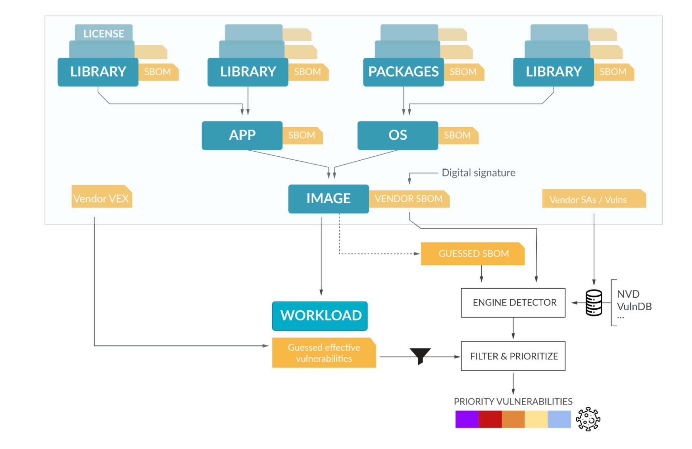

# SPDX vs SARIF vs CycloneDX vs ... - Which Format is the Best?


SBOM generation and vulnerability management throughout the SDLC (graphic taken from the excellent article at [devops.com](https://devops.com/sboms-101-what-you-need-to-know/))

A product manager walks into a zoom room and starts off:

- PM: We need more security and we need it yesterday! I need engineering to produce reports showing we do security and that we do it Right(TM).
- Engineer: Sure thing! What report format do you want? What requirements are you trying to meet?
- PM: How am I supposed to know? You are the engineers, _just_ follow best industry practices. Should be easy. Btw, I need a solution by end of sprint.

> The "just" Pro tip suggested by a friend and experienced engineer: everything that comes after the word "just" in the description of a development task should be piped to `/dev/null` and you should fight for a better description.

The exchange above may have never happened for you. If you're lucky, your PM/PO/CISO/Compliance Officer knew *exactly* what was needed, provided a complete specification and understood the scope of the effort. If you are less fortunate, you may have been in multiple conversations like the above and come across numerous formats and acronyms in your search for solutions that meet requirements: SPDX, SARIF, CycloneDX, VEX to name a few.

Lots of great articles online explain what each one format is about [[1]](https://devops.com/sboms-101-what-you-need-to-know/) [[2]](https://www.mayhem.security/blog/what-is-an-sbom-exploring-sbom-origins-and-use-in-software-security) [[3]](https://fossa.com/blog/sbom-formats-compared-explained/) [[4]](https://cyclonedx.org/guides/OWASP_CycloneDX-Authoritative-Guide-to-SBOM-en.pdf).

But, what's the best one to use? Are there differences? How strict are these formats and what can you expect? This is what we are covering in this article, asking yourself a few key questions to help you decide:

## Q0: SBOM vs SCA - Is there a difference?

## A0: Yes.

The two terms are used interchangeably online and that creates confusion. The confusion is exacerbated by the fact that some formats (e.g., CycloneDX) attempt to capture both SBOM and SCA reports. The key differences to track are the following:

1. **SBOM is about contents while SCA is about security/risk**. SBOM reports all the components of your software package. SCA reports all the vulnerabilities included in your software package.
2. **SBOM is static while SCA is dynamic**. The contents of your software package (SBOM) are determined at build/release time and the report is static/fixed. Vulnerabilities that affect your package (SCA) is something that changes constantly across time (today you have a clean report but tomorrow 2 new vulnerabilities were identified) and security scanners (scanner A may report a finding scanner B missed).

## Q1: Do I need both SBOM and SCA reports?

## A1: Yes.

Best practices recommend having _both_ SBOM artifacts for supply-chain transparency and compliance, as well as SCA artifacts for security and risk management produced as part of your SDLC.

Don't have time to follow best practices / produce both? Try to weigh what is more important for your organization and stakeholders - is it supply-chain transparency/compliance or security/risk management?

## Q2: Do you need an SBOM artifact?

## A2: Use [SPDX](https://spdx.dev/).

Why:

1. Communicates SBOM information, including components, licenses, copyright, and security references.
2. Open standard, mature development process with the Linux foundation and an active team developing it.
3. Extensive tooling support [[1]](https://spdx.dev/use/tools/) [[2]](https://github.com/advanced-security/spdx-dependency-submission-action>).

Why not:

* Your PM asked for a different format / has different requirements for what's needed out of the SBOM artifact.

## Q3: Do you need to report vulnerabilities from scanners?

## A3: Use [SARIF](https://sarif.info/).

Why:

1. Built to accommodate analysis results ranging from compiler warnings to security vulnerabilities.
2. [OASIS](https://www.oasis-open.org/) standard with multiple organizations and an active team [developing](https://github.com/oasis-tcs/sarif-spec) it.
3. Nearly all scanners support emitting SARIF reports. Significant ecosystem support [[1]](https://github.com/microsoft/sarif-tutorials) [[2]](https://docs.github.com/en/code-security/code-scanning/integrating-with-code-scanning/uploading-a-sarif-file-to-github).

Why not:

* Your PM asked for a separate format or perhaps something that combines security findings with SBOM like CycloneDX.

## Q4: Are we ever going to get SPDX with security findings within?

## A4: Yes!

The SPDX team recently [released v3.0](https://spdx.github.io/spdx-spec/) which provides direct support for including security findings within the SBOM report. No tools are currently producing v3.0 reports (yet!) but we expect that to change very very soon.

## Q5: I use different multiple SCA/SBOM tools - are the data easily comparable / mergeable?

## A5: No :(

Even though both SPDX and SARIF are standardized, the schemas they provide are too flexible and allow report producers to generate very disparate reports. For example, consider the following two reports for the exact same finding in the exact same package from two different tools (grype vs trivy):

```json
{
    "id": "CVE-2016-3189-libbz2-1.0",
    "name": "DpkgMatcherExactIndirectMatch",
    "shortDescription": {
        "text": "CVE-2016-3189 medium vulnerability for libbz2-1.0 package"
    },
    "fullDescription": {
        "text": "Version 1.0.6-7+b3 is affected with an available fix in versions 1.0.6-7+deb8u1"
    },
    "helpUri": "https://github.com/anchore/grype",
    "help": {
        "text": "Vulnerability CVE-2016-3189\nSeverity: medium\nPackage: libbz2-1.0\nVersion: 1.0.6-7+b3\nFix Version: 1.0.6-7+deb8u1\nType: deb\nLocation: /usr/share/doc/libbz2-1.0/copyright\nData Namespace: debian:distro:debian:8\nLink: [CVE-2016-3189](https://security-tracker.debian.org/tracker/CVE-2016-3189)",
        "markdown": "**Vulnerability CVE-2016-3189**\n| Severity | Package | Version | Fix Version | Type | Location | Data Namespace | Link |\n| --- | --- | --- | --- | --- | --- | --- | --- |\n| medium  | libbz2-1.0  | 1.0.6-7+b3  | 1.0.6-7+deb8u1  | deb  | /usr/share/doc/libbz2-1.0/copyright  | debian:distro:debian:8  | [CVE-2016-3189](https://security-tracker.debian.org/tracker/CVE-2016-3189)  |\n"
    },
    "properties": {
        "security-severity": "6.5"
    }
}
```

vs

```json
{
    "id": "CVE-2016-3189",
    "name": "OsPackageVulnerability",
    "shortDescription": {
        "text": "bzip2: heap use after free in bzip2recover"
    },
    "fullDescription": {
        "text": "Use-after-free vulnerability in bzip2recover in bzip2 1.0.6 allows remote attackers to cause a denial of service (crash) via a crafted bzip2 file, related to block ends set to before the start of the block."
    },
    "defaultConfiguration": {
        "level": "warning"
    },
    "helpUri": "https://avd.aquasec.com/nvd/cve-2016-3189",
    "help": {
        "text": "Vulnerability CVE-2016-3189\nSeverity: MEDIUM\nPackage: libbz2-1.0\nFixed Version: 1.0.6-7+deb8u1\nLink: [CVE-2016-3189](https://avd.aquasec.com/nvd/cve-2016-3189)\nUse-after-free vulnerability in bzip2recover in bzip2 1.0.6 allows remote attackers to cause a denial of service (crash) via a crafted bzip2 file, related to block ends set to before the start of the block.",
        "markdown": "**Vulnerability CVE-2016-3189**\n| Severity | Package | Fixed Version | Link |\n| --- | --- | --- | --- |\n|MEDIUM|libbz2-1.0|1.0.6-7+deb8u1|[CVE-2016-3189](https://avd.aquasec.com/nvd/cve-2016-3189)|\n\nUse-after-free vulnerability in bzip2recover in bzip2 1.0.6 allows remote attackers to cause a denial of service (crash) via a crafted bzip2 file, related to block ends set to before the start of the block."
    },
    "properties": {
        "precision": "very-high",
        "security-severity": "6.5",
        "tags": [
            "vulnerability",
            "security",
            "MEDIUM"
        ]
    }
}
```

The two reports are similar but far from identical. Crucially, the identifiers for the findings (CVE-2016-3189-libbz2-1.0 vs CVE-2016-3189) are not standardized and neither are the property contents. Beyond these differences, SBOM/SCA tools will report different sets of findings which creates follow up questions like "which SBOM tool should I be using?" - something we'll tackle in a follow up article.

## Q6: I got 2,000 vulnerabilities in my report! What do I do now?

## A6: Don't Panic! Try out [Mayhem's Dynamic SBOM](https://go.mayhem.security/mayhem-sbom) first.

Possibly the most painful realization for engineers _after_ they integrate SBOM and SCA solutions in their SDLC is the fact that they now have to deal with possibly thousands of newly identified vulnerabilities within their software. After all this work to produce SBOM/SCA artifacts, more work needs to be done to remediate them - a non-trivial task that may take weeks or even months!

Over 60% of these findings is typically because of packages that are included in your software but are entirely unused at runtime. [Mayhem's Dynamic SBOM (MDSBOM)](https://go.mayhem.security/mayhem-sbom) enables you to cut through the noise and automatically update your reports so that you can focus on vulnerabilities that are actually reachable and not waste time on findings that are not on the attack surface.

Are you interested to know more about SBOM/SCA formats? Shoot us an email and let us know!
